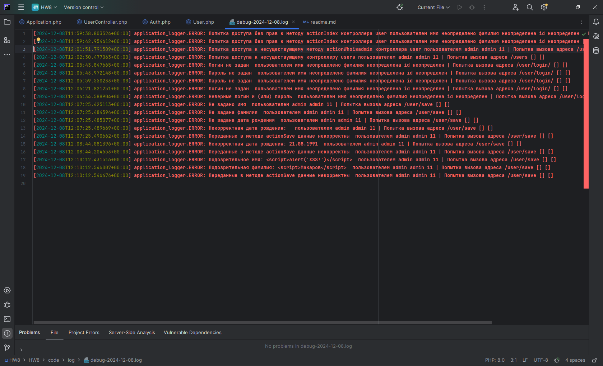
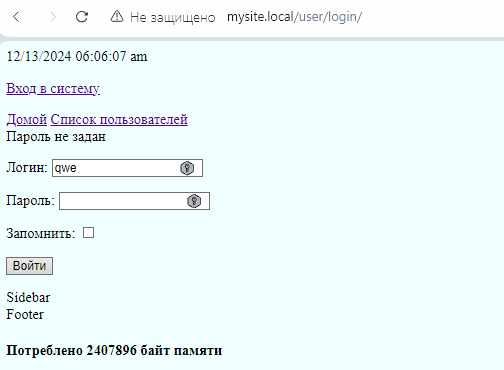
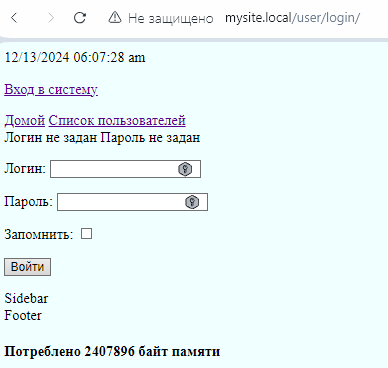
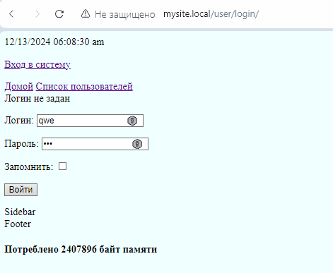
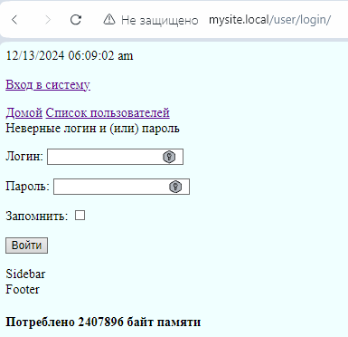

# Урок 8. Учимся собирать логи, дебажим приложение

В уже созданных маршрутах попробуйте вызывать их с некорректными данными. Что будет происходить? Будут ли появляться ошибки?

При появлении ошибок, произведите их анализ. Обязательно зафиксируйте шаги своих размышлений.
На основании анализа произведите устранение.

## Функцию логирования объявляю в классе Application
```
public static function logErrorToFile($logMessage): void {
    Application::$logger->error($logMessage);
}
```
Повторяющееся часть сообщения возвращается функцией
```
public static function commonTailOfLogMessage() : string {
    return " пользователем ".
        ($_SESSION['user_name'] ?? 'имя неопределено') . " " .
        ($_SESSION['user_lastname'] ?? 'фамилия неопределена') . " " .
        ($_SESSION['id_user'] ?? 'id неопределен') . " | Попытка вызова адреса ".$_SERVER['REQUEST_URI'];
}
```

## Класс Application:
### Метод run:
#### Если нет доступа к методу (например работаем под пользователем у которого нет прав):
```
if(method_exists($this->controllerName, $this->methodName)){
    $controllerInstance = new $this->controllerName();
    if ($controllerInstance instanceof AbstractController) {
        if ($this->checkAccessToMethod($controllerInstance, $this->methodName)) {
            return call_user_func_array(
                [$controllerInstance, $this->methodName],
                []
            );
        } else {
            // Добавлено логирование
            Application::logErrorToFile("Попытка доступа без прав к методу ".$this->methodName.
                                                   " контроллера ".$controllerName.
                                                   Application::commonTailOfLogMessage());
            // Добавлено логирование
                
            return "Нет доступа к методу";
        }
    } else {
            ...
        );
    }
}
else {
    ...
}
```
#### Если метод не существует (введен некорректный метод контроллера в адресной строке, например /user/whoisadmin ):
```
if(method_exists($this->controllerName, $this->methodName)){
    ...
}
else {
    // Добавлено логирование
    Application::logErrorToFile("Попытка доступа к несуществующему методу ".$this->methodName.
                                           " контроллера ".$controllerName. 
                                           Application::commonTailOfLogMessage());
    // Добавлено логирование

    throw new Exception("Метод " .  $this->methodName . " не существует");
}
```
#### Если контроллер не существует (введен некорректный контроллера в адресной строке, например /workers ):
```
if(class_exists($this->controllerName)){
    ...
else{
    // Добавлено логирование
    Application::logErrorToFile("Попытка доступа к несуществующему контроллеру ".$controllerName.
                                           Application::commonTailOfLogMessage());
    // Добавлено логирование
    
    throw new Exception("Класс $this->controllerName не существует");
}
```

## Класс UserController:
### Метод actionSave
```
public function actionSave() {
    if(User::validateRequestData()) {
        ...
    }
    else {
        // Добавлено логирование
        Application::logErrorToFile("Переданные в методе actionSave данные некорректны" . Application::commonTailOfLogMessage());
        // Добавлено логирование
        
        throw new \Exception("Переданные данные некорректны ");
    }
}
```
### Метод actionUpdate
```
public function actionUpdate() {
    ...
    if(User::exists($id)) {
        ...
    }
    else {
        // Добавлено логирование
        Application::logErrorToFile("Обновляемый пользователь не существует " . Application::commonTailOfLogMessage());
        // Добавлено логирование
                    
        throw new \Exception("Пользователь не существует");
    }
}
```
### Метод actionDelete
```
public function actionDelete() {
    ...
    if(User::exists($id)) {
        ...
    }
    else {
        // Добавлено логирование    
        Application::logErrorToFile("Удаляемый пользователь не существует " . Application::commonTailOfLogMessage());
        // Добавлено логирование
                
        throw new \Exception("Пользователь не существует");
    }
}
```
### Метод actionShow
```
public function actionShow(): string {
    ...
    if(User::exists($id)) {
        ...
    }
    else {
        // Добавлено логирование    
        Application::logErrorToFile("Показываемый пользователь не существует " . Application::commonTailOfLogMessage());
        // Добавлено логирование
                            
        throw new \Exception("Пользователь с таким id не существует");
    }
}
```
### Метод actionEdit
```
public function actionEdit() {
    ...
    // Удаление пользователя
    If (isset($_POST['action']) && $_POST['action'] != '+') {
        ...
        if(User::exists($id)) {
            ...
        }
        else {
            // Добавлено логирование        
            Application::logErrorToFile("Удаляемый пользователь не существует " . Application::commonTailOfLogMessage());
            // Добавлено логирование
                                
            throw new \Exception("Пользователь не существует");
        }
    }
    ...
}
```
### Метод actionLogin

```
public function actionLogin(): string {
    ...
    if  (!empty($_POST['login']) && !empty($_POST['password'])) {
        ...
    }
    else {
        // Добавлено логирование
        $auth_error = "";
        if (empty($_POST['login'])) {
            $auth_error = "Логин не задан";
            Application::logErrorToFile("Логин не задан " . Application::commonTailOfLogMessage());
        }
        if (empty($_POST['password'])) {
            $auth_error .= " Пароль не задан";
            Application::logErrorToFile("Пароль не задан " . Application::commonTailOfLogMessage());
        }

        $render = new Render();
        return $render->renderPageWithForm('user-auth.tpl',
            [
                'title' => 'Форма логина',
                'auth_success' => false,
                'auth_error' => $auth_error
            ]);
        // Добавлено логирование
    }

    if (!$result) {
        // Добавлено логирование    
        Application::logErrorToFile("Неверные логин и (или) пароль " . Application::commonTailOfLogMessage());            
        // Добавлено логирование            
        $render = new Render();
        return $render->renderPageWithForm('user-auth.tpl',
            [
                'title' => 'Форма логина',
                'auth_success' => false,
                'auth_error' => 'Неверные логин и (или) пароль'
            ]);
    } else {
        ...
    }
}
```

## Класс User:
### Метод validateRequestData
```
public static function validateRequestData(): bool{

    $result = true;

    if (!(isset($_POST['name']) && !empty($_POST['name']))){
        // Добавлено логирование
        Application::logErrorToFile("Не задано имя " . Application::commonTailOfLogMessage());
        // Добавлено логирование
        
        $result = false;
    }
    if (!(isset($_POST['lastname']) && !empty($_POST['lastname']))){
        // Добавлено логирование
        Application::logErrorToFile("Не задана фамилия " . Application::commonTailOfLogMessage());
        // Добавлено логирование
        
        $result = false;
    }
    if(!(isset($_POST['birthday']) && !empty($_POST['birthday']))){
        // Добавлено логирование
        Application::logErrorToFile("Не задана дата рождения " . Application::commonTailOfLogMessage());
        // Добавлено логирование
        
        $result = false;
    }
    if (!preg_match('/^(\d{2}-\d{2}-\d{4})$/', $_POST['birthday'])) {
        // Добавлено логирование
        Application::logErrorToFile("Некорректная дата рождения: " . ($_POST['birthday'] ?? 'пустая') .
                                               " " . Application::commonTailOfLogMessage());
        // Добавлено логирование
                                                       
        $result = false;
    }
    if (preg_match('/<([^>]*)>/', $_POST['name'])) {
        // Добавлено логирование
        Application::logErrorToFile("Подозрительное имя: " . ($_POST['name'] ?? 'пустая') . 
                                               " " . Application::commonTailOfLogMessage());
        // Добавлено логирование
                                                       
        $result = false;
    }
    if (preg_match('/<([^>]*)>/', $_POST['lastname'])) {
        // Добавлено логирование
        Application::logErrorToFile("Подозрительная фамилия: " . ($_POST['lastname'] ?? 'пустая') .
                                               " " . Application::commonTailOfLogMessage());
        // Добавлено логирование
                                                       
        $result = false;
    }
    if (preg_match('/<([^>]*)>/', $_POST['birthday'])) {
        // Добавлено логирование
        Application::logErrorToFile("Подозрительная дата рождения: " . ($_POST['birthday'] ?? 'пустая') .
                                               " " . Application::commonTailOfLogMessage());
        // Добавлено логирование
                                                       
        $result = false;
    }
    
    if (!isset($_SESSION['csrf_token']) || $_SESSION['csrf_token'] != $_POST['csrf_token']) {
        $result = false;
    }

    return $result;
}
```

## Так выглядит лог файл


---

## Ошибки ввода логина и пароля




